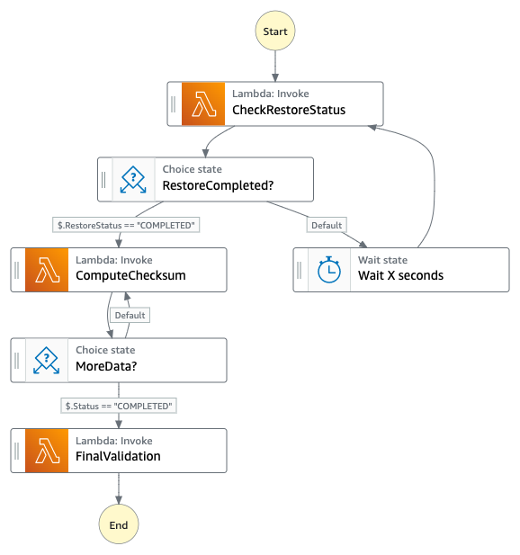

# Serverless Fixity for Digital Preservation Compliance Solution
Serverless Fixity for Digital Preservation Compliance solution allows customers to compute MD5 or SHA1 checksum on S3 object. The solution is built based on serverless architecture; thus, it is pay-as-you-go model without any upfront commitment and managing any resources. The solution also builds in logic to restore S3 object when the targeted object is on our S3 Glacier or S3 Glacier Deep Archive storage class. With a simple HTTP request specifying bucket and key values, you start the fixity process that restores, computes, validates MD5/SHA1 checksum and sends SNS notification when the process is completed.

----

## Architecture Overview


----

## Deployment
The solution is deployed using a CloudFormation template with AWS Lambda backed custom resources. Follow the instructions below to deploy the solution. To deploy this solution, follow the instructions:

--

#### Step 1: Launch CloudFormation stack
[](https://console.aws.amazon.com/cloudformation/home?region=us-east-1#/stacks/new?&templateURL=https%3A%2F%2Fs3.amazonaws.com%2Fsolutions-reference%2Fserverless-fixity-for-digital-preservation-compliance%2Flatest%2Fserverless-fixity-for-digital-preservation-compliance.template)

Click *Next* to continue

--

### Step 2: Specify stack details

| Name | Description |
|:---  |:------------|
| Stack name | any valid name |
| Email address | to receive email notification from SNS service when the checksum process is completed or failed|
| Access-Control-Allow-Origin | If you plan to use the api for web development, specify the origin here. Default uses wildard (*) |
| Anonymous Usage | Select 'Yes' to opt-in to help us to improve the solution. The solution collects and sends the following data **anonymously**: Algorithm used for the fixity process, FileSize of the object, Elapsed time of the fixity process, and the ComparedResult status (matched, notmatched, or skipped) |


--

### Step 3: Configure stack options
Leave it as is and click **Next**

--

### Step 4: Review
Make sure both checkboxes under Capabilities section are **CHECKED**


--

### Step 5: Locate API Gateway endpoint
After the CloudFormation stack is completed, click on the **Outputs** tab and search for **ApiEndpoint**. The value of **ApiEndpoint** is the RESTful API endpoint you will use to start and monitor the checksum process.


----

## Starting a fixity process
There are _three_ different ways to start a fixity process by:
* using AWS Management Console
* using AWS Command Line Interface (CLI)
* using Amazon API Gateway RESTful APIs

### Using AWS Management Console
Log in to AWS Management Console, go to Amazon CloudFormation Console, click on the stack you just created, click on **Outputs** tab, and search for **StateMachineName**. The value of the parameter is the the state machine name the solution created.


Now, go to Amazon Step Functions Console, click on **State machines**, and search for the state machine name you obtained in the previous step. Click on the state machine. You can start a new execution by clicking **Start execution**. Under **Input** field, you would provide **Bucket** and **Key** parameters in JSON format as followed.


--

### Using AWS Command Line Interface (CLI)
Similar to AWS Management Console, instead of using the console, you can start a fixity process with AWS CLI. _(Note: this assumes that you have AWS CLI installed, see [details](https://docs.aws.amazon.com/cli/latest/userguide/cli-chap-install.html))_

Create a JSON file that contains **Bucket** and **Key** key value pair.
```
{
    "Bucket": "<bucket-name>",
    "Key": "<path-to-s3-object>"
}
```
Save it to **input.json** _(note: the file name can be anything you want)_.
Run the following command to start a fixity process.
```
aws stepfunctions start-execution \
--state-machine-arn arn:aws:states:<region>:<account-id>:stateMachine:<state-machine-name> \
--input file://input.json
```
where
* **\<region\>** is the AWS region you created the serverless checksum stack
* **\<account-id\>** is your 12-digit AWS account id
* **\<state-machine-name\>** is the state machine name you obtained earlier from the Amazon CloudFormation stack, output tab.

The response contains the ARN of the new execution that you can use to proactively monitor the status of the execution
```
{
    "executionArn": "arn:aws:states:<region>:<account-id>:execution:<state-machine-name>:<execution-arn>",
    "startDate": 1573483212.677
}
```

--

### Using Amazon API Gateway RESTful APIs
Using the RESTful API endpoint allows you to programmatically start a fixity process. Because the RESTful API endpoint is authenticated with AWS_IAM, you would need create an IAM user (or IAM role) and attach **AmazonAPIGatewayInvokeFullAccess** policy to the user. Then, you can use the **Access key ID** and **Secret access key** to configure your tool like Postman.

1. Make sure to install [AWS CLI](https://docs.aws.amazon.com/cli/latest/userguide/cli-chap-install.html) and configure the profile, see details [here](https://docs.aws.amazon.com/cli/latest/userguide/cli-chap-configure.html)

2. Create a user and call it fixity-api-user

```
aws iam create-user --user fixity-api-user
```

3. Attach **AmazonAPIGatewayInvokeFullAccess** policy to the user

```
aws iam attach-user-policy \
--policy-arn arn:aws:iam::aws:policy/AmazonAPIGatewayInvokeFullAccess \
--user fixity-api-user
```


4. Create access key

```
aws iam create-access-key --user fixity-api-user
```

5. The command above returns the following response. Save the **AccessKeyId** and **SecretAccessKey** somewhere. We will need it to configure Postman later.

```
{
  "AccessKey": {
    "UserName": "fixity-api-user",
    "AccessKeyId": "<access-key-id>",
    "Status": "Active",
    "SecretAccessKey": "<secret-access-key>",
    "CreateDate": "2019-11-15T09:26:56Z"
  }
}
```

**IMPORTANT NOTE:** For simplicity, we attach **AmazonAPIGatewayInvokeFullAccess** policy to the api user. For production or staging environment, we highly recommend you to limit the policy to the least privilege access. For example, you can create a policy to allow the api user to only being able to invoke the solution RESTful API endpoints and provide **no permission** to other resources.

```
{
  "Version": "2012-10-17",
  "Statement": [
    {
      "Effect": "Allow",
      "Principal": {
        "AWS": "arn:aws:iam::<account>:user/fixity-api-user"
      },
      "Action": [
        "execute-api:Invoke"
      ],
      "Resource": [
        "arn:aws:execute-api:<region>:<account-id>:<api-id>/<stage>/OPTIONS/*",
        "arn:aws:execute-api:<region>:<account-id>:<api-id>/<stage>/GET/*",
        "arn:aws:execute-api:<region>:<account-id>:<api-id>/<stage>/POST/*",
        "arn:aws:execute-api:<region>:<account-id>:<api-id>/<stage>/DELETE/*"
      ]
    }
  ]
}
```

--

### Step 1: Configure Authentication under Postman
You can download and install Postman from https://www.getpostman.com/apps


| Field | Value |
|:---  |:------------|
| 1) Authorization type | choose *AWS Signature* |
| 2) AccessKey | *Access key ID* of the IAM user |
| 3) SecretKey | *Secret access key* of the IAM user |
| 4) AWS Region | the region you created the stack |
| 5) Service Name | execute-api |

--

### Step 2: To start a checksum process
1. Set HTTP method to **POST**
2. Copy and paste the **ApiEndpoint** you find from your CloudFormation stack.
3. Click on **Body** tab, select **raw** and select **JSON**
4. For fixity using **MD5** algorithm, specify **Bucket** and **Key** at the minimum. Then, click on **Send**.
```
{
    "Bucket": "sample-bucket",
    "Key": "assets/50GB.mxf"
}
```

5. For fixity using **SHA1** algorithm, you would also specify **Algorithm** field as follows:
```
{
    "Bucket": "sample-bucket",
    "Key": "assets/50GB.mxf",
    "Algorithm": "sha1"
}
```


Here is a list possible options for the request body.

| Key | Type | Description |
|:---  |:------------|:--- |
| Bucket | String | (Mandatory) bucket name of the s3 object to be processed |
| Key | String | (Mandatory) location of the s3 object to be processed |
| Algorithm | String | (Optional) "md5" or "sha1". If not specified, it defaults to "md5" |
| Expected | String | (Optional) Hex string (32 characters for MD5 and 40 characters for SHA1) represents the checksum value you are expecting. If it is specified, the solution uses **Expected** field to compare with the checksum value calculated by the process. The response body will indicate whether they are **MATCHED** or **NOTMATCHED**. If not specified, the solution uses the best guess logic to extract any _pre-existing_ checksum associated with the s3 object for comparison. See more details in "APPENDIX A: Best effort of comparing checksum" |
| ChunkSize | Number | (Optional) Specify in bytes. By default, the solution uses at most 20GB data size to incrementally compute the checksum by performing a byte-range S3 GetObject. |
| StoreChecksumOnTagging | Boolean | A flag indicates if the solution should store the computed checksum to the object tagging (putObjectTagging). This could be useful for two reasons: (1) you could use getObjectTagging to retrieve a computed-checksum. (2) if you would like to re-run the checksum on the same object again, the solution could use the **stored** checksum as a reference to compare the computed value.By default, it is set to **true**. If you don't want to store the checksum to object tagging, you should explicitly set **StoreChecksumOnTagging** to **false** in the HTTP request body |
| RestoreRequest.Days | Number | (Optional) Specify how long should the asset be kept once it is restored. By default, the asset stays in _hot_ storage for 1 day. |
| RestoreRequest.Tier | String | (Optional) Specify the restore request tier. Possible values are **Standard**, **Bulk**, or **Expedited**. By default, it is set to **Bulk**. See more details on [Archive Retrieval Options](https://docs.aws.amazon.com/AmazonS3/latest/dev/restoring-objects.html#restoring-objects-retrieval-options) and [Data Retrievals Pricing](https://aws.amazon.com/s3/pricing/) |

The example below demonstrates a HTTP request that disables **object tagging**, uses **Expedited** restore method, and keeps the s3 object in **hot** storage for one week.

```
{
    "Bucket": "sample-bucket",
    "Key": "assets/50GB.mxf",
    "Algorithm": "sha1",
    "StoreChecksumOnTagging": false,
    "RestoreRequest": {
        "Days": 7,
        "Tier": "Expedited"
    }
}
```

When the request is accepted, the response body returns an executionArn which is the unique identifier of the fixity execution of the state machine.

You can then use the executionArn to proactively monitor the fixity status.

_Note: by default, when the fixity process completes (or fails), the solution sends a notification message to the subscribed users using Amazon SNS service. You can build automation around the notification. For example, if you have a process keeping track of the history of all s3 object fixity checks, you can automate the process to automatically update the s3 object's last-validated-date in your database when receives an Amazon SNS notification._

```
{
    "executionArn": "arn:aws:states:<region>:<account-id>:execution:<state-machine-name>:<execution-arn>",
    "startDate": "2018-12-18T12:45:30.430Z"
}
```

--

### Step 3: To monitor the checksum status
1. Set HTTP method to GET
2. Copy and paste the **ApiEndpoint** you get from the Cloudformation stack and append a querystring, **executionArn**:
```
https://<ApiEndpoint>?executionArn=<execution-arn>
```
where
    * **\<execution-arn\>** is the **executionArn** you obtain from previous step (the response from starting the fixity process). You can use either the long form or a short form of the executionArn.
    ```
    Long form
    executionArn=arn:aws:states:<region>:<account-id>:execution:<state-machine-name>:<execution-arn>

    Short form
    executionArn=<execution-arn>
    ```

3. Under the Body tab, click on **none**

4. Click on **Send** to send the request


----

## Appendix A: IAM Role Policy and Bucket Policy

By default, the solution allows you to run the fixity check on any object and bucket within your AWS account. Therefore, it is important to understand the permission granted to the solution and that you can re-configure the permission to provide a more restricted access to specific resources such as a set of dedicated buckets that require to perform fixity check.

The following diagram illustrates the permission access from the lambda function to the S3 bucket. Each of the lambda functions created by the solution is given an IAM role. Each IAM role attaches a specific IAM policy that grants specific permission to that role. Then, there is also a bucket policy that you _may_ have attached to your bucket.


### Lambda Function and its IAM role and permission
Each lambda function within the state machine is associated with its own IAM role. The role is given the least privilege of permission access that is required to run.

#### CheckRestoreStatus function
A state where a lambda function performs restore action when is necessary. Its role is given permissions to get and restore object, see below.
```
{
    "Version": "2012-10-17",
    "Statement": [
        {
            "Action": [
                "s3:GetObject",
                "s3:RestoreObject"
            ],
            "Resource": "arn:aws:s3:::*/*",
            "Effect": "Allow"
        },
        {
            "Action": [
                "logs:CreateLogGroup",
                "logs:CreateLogStream",
                "logs:PutLogEvents"
            ],
            "Resource": [
                "arn:aws:logs:<region>:<account-id>:log-group:/aws/lambda/*"
            ],
            "Effect": "Allow"
        }
    ]
}
```

#### ComputeChecksum function
A state where a lambda function performs MD5/SHA1 checksum. Its role is given the get object permission.

```
{
    "Version": "2012-10-17",
    "Statement": [
        {
            "Action": [
                "s3:GetObject"
            ],
            "Resource": "arn:aws:s3:::*/*",
            "Effect": "Allow"
        },
        {
            "Action": [
                "logs:CreateLogGroup",
                "logs:CreateLogStream",
                "logs:PutLogEvents"
            ],
            "Resource": [
                "arn:aws:logs:<region>:<account-id>:log-group:/aws/lambda/*"
            ],
            "Effect": "Allow"
        }
    ]
}
```

#### FinalValidation function
A state where a lambda function validates MD5 or SHA1 checksum value. Its role is given permission to get object and object tagging, put object tagging, and publish to a specific sns topic.

```
{
    "Version": "2012-10-17",
    "Statement": [
        {
            "Action": [
                "s3:GetObject",
                "s3:GetObjectTagging",
                "s3:GetObjectVersionTagging",
                "s3:PutObjectTagging",
                "s3:PutObjectVersionTagging"
            ],
            "Resource": "arn:aws:s3:::*/*",
            "Effect": "Allow"
        },
        {
            "Action": [
                "logs:CreateLogGroup",
                "logs:CreateLogStream",
                "logs:PutLogEvents"
            ],
            "Resource": [
                "arn:aws:logs:<region>:<account-id>:log-group:/aws/lambda/*"
            ],
            "Effect": "Allow"
        },
        {
            "Action": [
                "sns:Publish"
            ],
            "Resource": [
                "arn:aws:sns:<region>:<account-id>:<sns-topic-name>"
            ],
            "Effect": "Allow"
        }
    ]
}
```

At this point, you may already notice that the policy of all state machine lambda functions uses a **wildcard** on S3 resources which permits the solution to operate on any s3 object of any bucket within your AWS account.

```
"Resource": "arn:aws:s3:::*/*"
```

We highly recommend that you restrict the policy to only provide access to dedicated bucket(s) that requires to run fixity process. There are two different ways that you can achieve that.

* First, if you have already deployed the solution, you would then modify each of the lambda execution roles directly. See [Appendix G: Modify IAM Role policy to allow specific bucket](#appendix-g-modify-iam-role-policy-to-allow-specific-bucket)

* If you are building and hosting the solution on your own, you can modify the CloudFormation template before you build the solution. See [Appendix H: Modify CloudFormation template to allow specific bucket](#appendix-h-modify-cloudformation-template-to-allow-specific-bucket)

--

### Bucket policy
We have covered the IAM role, policy, and permission given to each of lambda functions of the solution earlier. Techincally the access permission given to the lambda functions should have access to your bucket(s). If you are receiving **Access Denied** error from the solution, it is very likely that your bucket is configured with  [Bucket policy](https://docs.aws.amazon.com/AmazonS3/latest/dev/example-bucket-policies.html).

Bucket policy dictates who has access to the bucket and what types of actions (GetObject, PutObject, DeleteObject, and so forth) can be performed to the bucket and object.

For an example, let's say we have the followings:
* **Bucket A**
* **Lambda Function B**

where **Bucket A** has an explicit Bucket policy to deny access to all IAM roles.

In this scenario, even although you have already given GetObject permission to the **Lambda Function B** to access objects in **Bucket A**, you would still get an **Access Denied** error because the Bucket policy of **Bucket A** prevents all IAM roles to access its resources.

In other words, the Bucket policy is the last gatekeeper to a specific bucket resources.

By default, the solution does **not** modify any Bucket policy that associates with your bucket. Therefore, if you do encounter **Access Denied** error, the first place to check is the bucket policy and to ensure the bucket policy allows the solution to access its resources.


Here is an example of allowing GetObject access to a specific IAM role.
```
{
    "Version": "2012-10-17",
    "Statement": [
        {
            "Effect": "Allow",
            "Principal": {
                "AWS": "arn:aws:iam::<account-id>:role/<lambda-execution-role>"
            },
            "Action": [
                "s3:GetObject"
            ],
            "Resource": [
                "arn:aws:s3:::<bucket-name>/*"
            ]
        }
    ]
}
```

For more details, check out [How do I allow my Lambda execution role to access my Amazon S3 bucket?](https://aws.amazon.com/premiumsupport/knowledge-center/lambda-execution-role-s3-bucket/)


----


## Appendix B: Amazon SNS Notification
As mentioned earlier, when you create the CloudFormation stack of the solution, you specify an email address to the stack. The email is automatically subscribed to an Amazon SNS topic created by the solution. When a fixity process completes or fails, the solution sends the notification to the subscribed user.

The following example shows the Amazon SNS message you will receive from the solution.
```
{
  "Elapsed": 38536,
  "Bucket": "some-bucket",
  "Key": "assets/test.mp4",
  "FileSize": 1860487570,
  "State": "ChecksumValidation",
  "Status": "COMPLETED",
  "Algorithm": "md5",
  "Computed": "<32 Hex characters>",
  "Expected": "<32 Hex characters>",
  "ComparedWith": "api",
  "ComparedResult": "MATCHED",
  "StoreChecksumOnTagging": true,
  "TagUpdated": true
}
```

| Key | Description |
|:---  |:------------|
| Elapsed | Time elapsed in milliseconds of the checksum execution of the s3 object. The Elapsed time represents the actual lambda runtime of each execution. _Note that the wait time in the Wait state during the restore process is not included._ |
| Bucket | Pass through from POST request |
| Key | Pass through from POST request |
| FileSize | File size of the s3 object |
| State | Last state of the state machine |
| Status | indicated it is COMPLETED |
| Algorithm | algorithm used to compute checksum, md5 or sha1 |
| Computed | This is the checksum computed by the solution |
| Expected | Pass through from POST request |
| ComparedWith | Could be api, object-metadata, object-tagging, object-etag, or none |
| ComparedResult | MATCHED, NOTMATCHED, or SKIPPED |
| TagUpdated | true or false. This indicates whether the object tags have been successfully updated. |
| RestoreExpiredAt | Indicates when the s3 object will transition back to Glacier/Deep Archive storage |

----

## Appendix C: Best effort of comparing checksum

### Using MD5 algorithm
The solution uses the following logic to determine and compare the checksum value where

* *Computed* refers to the one is generated by the workflow
* *Expected* refers to the user-provided checksum value through the POST request payload
* *computed-md5* tag refers to an object tagging field associated with the S3 object
* *x-amz-metadata-md5* refers to a Metadata field associated with the S3 object
* *ETag* refers to the ETag field of the S3 object. Important to note that we only use the ETag field _if and only if_ it is
    * a single PutObject (not multipart) upload
    * file size is less than 5GB
    * and SSE encryption is either none or aes256


The result of the comparison is stored in “ComparedResult” and “ComparedWith” in the response body.

ComparedResult could be:
* MATCHED — indicates that the “Computed” checksum is matching one of the “existing” checksum
* NOTMATCHED — indicates that the “Computed” checksum does _not_ match the “existing” checksum. This would certainly require your attention!
* SKIPPED — indicates that the solution cannot find any “existing” checksum to compare to; thus, it skips the checksum validation


ComparedWith provides which existing checksum the solution used to compare with.
* api — refers to “Expected” field is provided through the API POST request payload
* object-tagging — refers to “computed-md5” tag. This could be a checksum you have run with StoreChecksumOnTagging enabled before. And, the future run of the same S3 object would be able to use this “compute-md5” tag to compare the result.
* object-metadata — refers to “x-amz-metadata-md5” associated with the S3 object. This Metadata would have to be manually create and store in the Metadata field when you first upload the S3 object
* object-etag — refers to the ETag of the S3 object
* none — cannot find any suitable, pre-existing checksum associated to the S3 object


### Using SHA1 algorithm
Simliar to MD5, the differences are:
* object tag name is **computed-sha1** instead of *computed-md5*
* metadata name is **x-amz-metadata-sha1** instead of **x-amz-metadata-md5**
* ETag is not checked

----

## Appendix D: Serverless Fixity for Digital Preservation Compliance state machine



### CheckRestoreStatus state
In this state, the lambda uses headObject to find the storage class of the object. If it is Glacier or Deep Archive storage class, it checks to the restore status. If restore has yet been called, it starts the restore process by calling restoreObject api.

### RestoreCompleted? state
This is a Choice state to check the restore status by checking $.RestoreStatus, $.StorageClass, and $.RestoreRequest.Tier values and decide which state to switch next. If $.RestoreStatus is set to COMPLETED indicating the restore process has completed, it moves to **ComputeChecksum** state. Otherwise, it bases on the storage class and the restore tier values to decide how long the solution should pause the execution.

For example, if the storage class is 'GLACIER' and the restore request tier is 'Expedited', it switches to **Wait 4 mins** state.

### Wait 4 mins state
The Wait state simply waits for 4 minutes and then switches back to CheckRestoreStatus to check the status again. The criteria of entering this state is that the storage class is 'GLACIER' and restore request tier is 'Expedited'.

### Wait 12 hrs state
The Wait state waits for 12 hours and then switches back to CheckRestoreStatus to check the status again. The criteria of entering this state is that the storage class is 'DEEP_ARCHIVE' and restore request tier is 'Bulk'.

### Wait 4 hrs state
The Wait state simply waits for 4 hours and then switches back to CheckRestoreStatus to check the status again. This is a default wait state to handle 'Standard' restore tier request.

### ComputeChecksum state
In this state, the lambda getObject with byte range, specified in ChunkSize (default to 2GB) and computes the checksum. If there is more data, the function returns the intermediate hash value of the checksum. On the next execution, it uses the previous intermediate hash state to continue the checksum computation.

### MoreData? state
This is a Choice state to determine whether the computation has completed based on $.Status value.

### FinalValidation state
In this state, the checksum has been computed and stored in “Computed” key. The lambda uses its best effort to find a pre-existing checksum associated with the S3 object and compare the checksum result. It also publish the result to SNS topic.

### ChecksumError
Catch error from the state machine and send the error message to SNS topic


----

## Appendix E: Customizing and building the solution

### Running unit tests for customization
* Clone the repository, then make the desired code changes
* Next, run unit tests to make sure added customization passes the tests
```
cd ./deployment
bash ./run-unit-tests.sh
```

### Building distributable for customization
* Configure the bucket name of your target Amazon S3 distribution bucket
```
export BUCKET=my-bucket-name # bucket where customized code will reside
export SOLUTION=my-solution-name
export VERSION=my-version # version number for the customized code
```
_Note:_ You would have to create an S3 bucket with the prefix 'my-bucket-name-<region>'; region is where you are testing the customized solution. Also, the assets in bucket should be publicly accessible.

* Now build the distributable:
```
cd ./deployment
bash ./build-s3-dist.sh --bucket $BUCKET [--solution $SOLUTION] [--version $VERSION]
```

* Deploy the distributable to an Amazon S3 bucket in your account. _Note:_ you must have the AWS Command Line Interface installed.
```
    # copy packages
    aws s3 cp ./regional-s3-assets/ s3://<bucket-basename>-<region>/$SOLUTION/$VERSION/ --recursive --acl bucket-owner-full-control --profile <aws-cred-profile-name>
```

* Get the link of the solution template uploaded to your Amazon S3 bucket.
* Deploy the solution to your account by launching a new AWS CloudFormation stack using the link of the solution template in Amazon S3.

---- 

## Appendix F: File structure

| Path | Description |
|:---  |:------------|
| deployment/ | cloudformation templates and shell scripts |
| deployment/common.sh | shell script used by others |
| deployment/build-s3-dist.sh | shell script to build the solution |
| deployment/deploy-s3-dist.sh | shell script to deploy the solution |
| deployment/run-unit-tests.sh | shell script to run unit tests |
| deployment/serverless-fixity-for-digital-preservation-compliance.yaml | solution CloudFormation main deployment template |
| deployment/serverless-fixity-for-digital-preservation-compliance-api-stack.yaml | solution CloudFormation template for deploying API services |
| deployment/serverless-fixity-for-digital-preservation-compliance-state-machine-stack.yaml | solution CloudFormation template for deploying checksum state machine |
| source/ | source code folder |
| source/checksum/ | microservice for checksum state machine  |
| source/checksum/lib/algorithm/ | mmicroservice to handle md5 and sha1 checksum |
| source/checksum/lib/api/ | microservice to handle API requests |
| source/checksum/lib/restore/ | microservice to handle S3 object restore process |
| source/checksum/lib/shared/ | shared library |
| source/checksum/lib/sns/ | wrapper to Amazon SNS service |
| source/checksum/lib/validation/ | microservice to validate checksum |
| source/custom-resources/ | AWS CloudFormation custom resource for aiding the deployment of the solution |
| source/samples/ | sample codes |

----

## Appendix G: Modify IAM Role policy to allow specific bucket

If you have already deployed the solution and are looking to enhance the permission of the solution, read on.

A list of lambda functions created by the solution that have access to your buckets are:

| Lambda Function | Usage | Resource access |
|:----------------|:------|:-------|
| SO0081-\<stack-name\>-CheckRestoreStatus | associate to **CheckRestoreStatus** state of the state machine | get and restore objects on **any bucket** within your AWS account |
| SO0081-\<stack-name\>-ComputeChecksum | associate to **ComputeChecksum** state of the state machine | get objects on **any bucket** within your AWS account |
| SO0081-\<stack-name\>-FinalValidation | associate to **FinalValidation** state of the state machine | get objects, get and put object tagging on **any bucket** within your AWS account. ability to publish to specific sns topic. |

To modify the lambda execution role,
1. Log on to AWS Management Console
2. Go to **Lambda Console**
3. Search for **SO0081** which is our solution unique Id
4. Click on the lambda function
5. Scroll down until you see **Execution role** section
6. Click on the role (highlighted) link brings you to IAM console

7. Under the IAM console, click on **Permission** tab and **Edit policy**

8. Replace the s3 resource with your specific requirements
```
"Resource": "arn:aws:s3:::*/*"
```
to
```
"Resource": [
    "arn:aws:s3:::bucket-a/*",
    "arn:aws:s3:::bucket-b/*",
    "arn:aws:s3:::bucket-c/*"
]
```
9. When you are done editing the policy, click on **Review policy** and **Save changes**
10. Repeat **Step 1** to **9** until you change all polices used by the set of lambda functions


----

## Appendix H: Modify CloudFormation template to allow specific bucket

If you are building the solution, you can modify the CloudFormation templates to specify the bucket resources before you build the solution.

1. Open your text editor
2. Open ./deployment/**serverless-fixity-for-digital-preservation-compliance-state-machine-stack.yaml**
3. Search for **arn:aws:s3:::\*/\*** and replace it with your specific requirement. There should be **three** appearances (one for each lambda execution role)
4. Save the file and [build the solution](#appendix-e-customizing-and-building-the-solution)


----

## Appendix I: Sample codes

### Run a fixity process report

The solution comes with a sample code, [execution-summary.js](./source/samples/execution-summary.js) that helps to understand how much resources a specified fixity process consumes that includes the lambda executions from different states and the number of state transitions. The sample code creates a summary and writes it a **CSV file** under your current folder.

To run the sample code, cd to **./source/samples** directory and run the following command:

```
npm install
export AWS_REGION=<aws-region>
node execution-summary.js --arn <execution-arn>
```
where

**\<aws-region\>** is the AWS Region where you create the solution, i.e., **us-east-1**.

**\<execution-arn\>** you can find it from AWS Step Functions console:
* Go to **AWS Step Functions console**, select **State machines**, click on the serverless-fixity state machine. The naming convention of the state machine is SO0081-**\<stack-name\>**-serverless-fixity where **\<stack-name\>** is the name you specified when you create the solution.
* Click on the **SO0081-\<stack-name\>-serverless-fixity** state machine, you should see a list of executions.
* Click on one of the executions and you will find the **Execution ARN**
* Use the **Execution ARN** for the commandline option **--arn**, see an example below:

```
npm install

export AWS_REGION=eu-west-1

node execution-summary.js \
--arn arn:aws:states:eu-west-1:<account-id>:execution:<state-machine-name>:<execution-arn>
```

----

## Collection of operational metrics

This solution collects anonymous operational metrics to help AWS improve the
quality of features of the solution. For more information, including how to disable
this capability, please see the [implementation guide](https://docs.aws.amazon.com/solutions/latest/serverless-fixity-for-digital-preservation-compliance/collection-of-operational-metrics.html).

----

## License

Copyright Amazon.com, Inc. or its affiliates. All Rights Reserved.

Permission is hereby granted, free of charge, to any person obtaining a copy of this
software and associated documentation files (the "Software"), to deal in the Software
without restriction, including without limitation the rights to use, copy, modify,
merge, publish, distribute, sublicense, and/or sell copies of the Software, and to
permit persons to whom the Software is furnished to do so.

THE SOFTWARE IS PROVIDED "AS IS", WITHOUT WARRANTY OF ANY KIND, EXPRESS OR IMPLIED,
INCLUDING BUT NOT LIMITED TO THE WARRANTIES OF MERCHANTABILITY, FITNESS FOR A
PARTICULAR PURPOSE AND NONINFRINGEMENT. IN NO EVENT SHALL THE AUTHORS OR COPYRIGHT
HOLDERS BE LIABLE FOR ANY CLAIM, DAMAGES OR OTHER LIABILITY, WHETHER IN AN ACTION
OF CONTRACT, TORT OR OTHERWISE, ARISING FROM, OUT OF OR IN CONNECTION WITH THE
SOFTWARE OR THE USE OR OTHER DEALINGS IN THE SOFTWARE.
