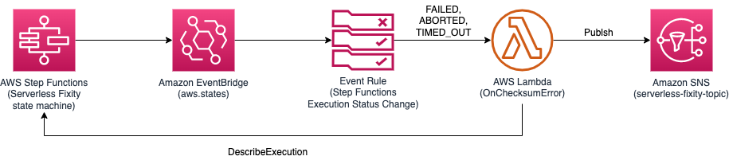

# Serverless Fixity for Digital Preservation Compliance Solution

## Table of contents
* [Introduction](#introduction)
    * [Recommendations](#recommandations)
* [Architecture Overview](#architecture-overview)
* [Prebuilt AWS CloudFormation templates](#prebuilt-aws-cloudformation-templates)
    * [Quick create stack](#quick-create-stack)
* [Building and customizing the solution](#building-and-customizing-the-solution)
    * [Prerequisite](#prerequisite)
        * [NodeJS 20.x](#nodejs-20x)
        * [AWS CLI](#aws-cli)
        * [JQ](#jq)
        * [Docker](#docker)
        * [Amazon S3 Bucket](#amazon-s3-bucket)
    * [Building the code](#building-the-code)
    * [Launching your customzied solution](#launching-your-customzied-solution)
        * [Option 1: Using AWS CLI command](#option-1-using-aws-cli-command)
        * [Option 2: Launch solution on AWS Console](#option-2-launch-solution-on-aws-console)
* [Deleting the solution](#deleting-the-solution)
* [Starting a fixity process](#starting-a-fixity-process)
    * [Option 1: Using AWS CLI to start servreless fixity state machine](#option-1-using-aws-cli-to-start-servreless-fixity-state-machine)
    * [Option 2: Using cURL and API Gateway endpoint](#option-2-using-curl-and-api-gateway-endpoint)
* [A list of input parameters to start fixity process](#a-list-of-input-parameters-to-start-fixity-process)
    * [Example 1: Simple request to compute MD5 checksum](#example-1-simple-request-to-compute-md5-checksum)
    * [Example 2: Compute SHA1 checksum and use Standard restore from Amazon S3 archive storage when necessary](#example-2-compute-sha1-checksum-and-use-standard-restore-from-amazon-s3-archive-storage-when-necessary)
    * [Example 3: Compute SHA1 checksum on object stored in Vendor's bucket](#example-3-compute-sha1-checksum-on-object-stored-in-vendors-bucket)
* [Cost](#cost)
* [Security: IAM Role policy](#security-iam-role-policy)
* [APPENDICES](#appendice-code-structure)
    * [Code structure](#appendice-code-structure)
    * [Best effort checksum comparison](#appendice-best-effort-checksum-comparison)
    * [Serverless Fixity for Digital Preservation Compliance state machine](#appendice-serverless-fixity-for-digital-preservation-compliance-state-machine)
    * [State Machine Error Handling](#appendice-state-machine-error-handling)
    * [Amazon SNS Notification](#appendice-amazon-sns-notification)
    * [Accessing S3 objects hosted in Vendor's AWS Accounts](#appendice-accessing-s3-objects-hosted-in-vendors-aws-accounts)
* [Collection of operational metrics](#collection-of-operational-metrics)
* [License](#license)

__

## Introduction

Serverless Fixity for Digital Preservation Compliance solution allows customers to compute `MD5`, `SHA1`, or `SHA256` checksum on S3 object. The checksum value of this solution reprsents the entire S3 object regardless of it is uploaded by a single [PutObject](https://docs.aws.amazon.com/AmazonS3/latest/API/API_PutObject.html) or [MultipartUpload](https://docs.aws.amazon.com/AmazonS3/latest/API/API_CreateMultipartUpload.html) operation.

```
checksum = checksum(Entire_object)
```

Amazon S3 also added a [New Checksum Support](https://aws.amazon.com/blogs/aws/new-additional-checksum-algorithms-for-amazon-s3/) that allows you to retrieve the checksum through [GetObjectAttributes](https://docs.aws.amazon.com/AmazonS3/latest/API/API_GetObjectAttributes.html) API. However, it is important to note that the checksum of the S3 object can be a checksum of the whole s3 object or a checksum of the sum of the checksums of each individual multipart object as follows:

```
checksum = checksum(checksum(Part_1) + checksum(Part_2) + checksum(Part_3))
```

### Recommandations

If you need a fixity solution to simply validate the data integrity of an object and you don't care about if the checksum represents the entire object or the checksum represents the collective checksums of the multipart-ed objects, then use the [New Checksum Support](https://aws.amazon.com/blogs/aws/new-additional-checksum-algorithms-for-amazon-s3/). [Building scalable checksums](https://aws.amazon.com/blogs/media/building-scalable-checksums/) blog post describes how you can parallelize the checksum process.

If you need a checksum of the entire object regardless of how it is uploaded (single PutObject or MultipartUpload), recommend to use this `Serverless Fixity for Digital Preservation Compliance solution`.

--

## Architecture overview


The solution is built based on serverless architecture; thus, it is `pay-as-you-go` model without any upfront commitment and managing any resources. The solution also builds in logic to restore S3 object when the targeted object is on our `Amazon S3 Glacier Flexible Retrieval (Formerly S3 Glacier)` or `Amazon S3 Glacier Deep Archive` storage class.

With a simple HTTPS POST request specifying bucket and key values, you start the fixity process that restores, computes, validates `MD5`, `SHA1`, or `SHA256` checksum and sends SNS notification when the process is completed.

The solution can also be used to compute checksum of an object from cross account bucket. See [APPENDICE: Accessing S3 objects hosted in Vendor's AWS Accounts](#appendice-accessing-s3-objects-hosted-in-vendors-aws-accounts) for how to configure cross account bucket and access.

--

## Prebuilt AWS CloudFormation templates

_Version: 1.4.0_

The solution is deployed using an AWS CloudFormation template with AWS Lambda backed custom resources. To deploy the solution, use one of the following CloudFormation templates and follows the instructions.

|Region|1-click Quick Deploy|Template URL|
|:--|:--|:--|
|US East (N. Virginia)|<a href="https://console.aws.amazon.com/cloudformation/home?region=us-east-1#/stacks/quickcreate?templateURL=https://awsi-megs-guidances-us-east-1.s3.amazonaws.com/serverless-fixity-for-digital-preservation-compliance/latest/serverless-fixity-for-digital-preservation-compliance.template&stackName=serverless-fixity" target="_blank">Launch stack</a>|https://awsi-megs-guidances-us-east-1.s3.amazonaws.com/serverless-fixity-for-digital-preservation-compliance/latest/serverless-fixity-for-digital-preservation-compliance.template|
|US East (Ohio)  |<a href="https://console.aws.amazon.com/cloudformation/home?region=us-east-2#/stacks/quickcreate?templateURL=https://awsi-megs-guidances-us-east-2.s3.us-east-2.amazonaws.com/serverless-fixity-for-digital-preservation-compliance/latest/serverless-fixity-for-digital-preservation-compliance.template&stackName=serverless-fixity" target="_blank">Launch stack</a>|https://awsi-megs-guidances-us-east-2.s3.us-east-2.amazonaws.com/serverless-fixity-for-digital-preservation-compliance/latest/serverless-fixity-for-digital-preservation-compliance.template|
|US West (Oregon)|<a href="https://console.aws.amazon.com/cloudformation/home?region=us-west-2#/stacks/quickcreate?templateURL=https://awsi-megs-guidances-us-west-2.s3.us-west-2.amazonaws.com/serverless-fixity-for-digital-preservation-compliance/latest/serverless-fixity-for-digital-preservation-compliance.template&stackName=serverless-fixity" target="_blank">Launch stack</a>|https://awsi-megs-guidances-us-west-2.s3.us-west-2.amazonaws.com/serverless-fixity-for-digital-preservation-compliance/latest/serverless-fixity-for-digital-preservation-compliance.template|
|Europe (Ireland)|<a href="https://console.aws.amazon.com/cloudformation/home?region=eu-west-1#/stacks/quickcreate?templateURL=https://awsi-megs-guidances-eu-west-1.s3.eu-west-1.amazonaws.com/serverless-fixity-for-digital-preservation-compliance/latest/serverless-fixity-for-digital-preservation-compliance.template&stackName=serverless-fixity" target="_blank">Launch stack</a>|https://awsi-megs-guidances-eu-west-1.s3.eu-west-1.amazonaws.com/serverless-fixity-for-digital-preservation-compliance/latest/serverless-fixity-for-digital-preservation-compliance.template|


### Quick create stack


| Name | Description |
| :--- | :---------- |
| Stack name | specify a stack name |
| Content Bucket list | a list of bucket names that the solution has access to. Default to asterisk (*), allows the solution to access any object and bucket within your AWS Account |
| Email address | an email address to receive notification from Amazon SNS service when the process is completed (or failed) |
| Access-Control-Allow-Origin | if you plan to use the API from a web application and want to limit to specific origin, specify the `allowable origin`. Default to asterisk (*) |
| List of vendor's IAM Roles | If you plan to use the solution to compute objects that are resided on a different AWS accounts, specify a list of the Cross Account IAM Roles of the other AWS accounts. Leave it blank if you don't need to consume objects from another AWS account. |

Make sure the following capabilities are checked:
- [x] I acknowledge that AWS CloudFormation might create IAM resources with custom names.
- [x] I acknowledge that AWS CloudFormation might require the following capability: CAPABILITY_AUTO_EXPAND

Click **Create stack** to create the solution.


__

## Building and customizing the solution

### Prerequisite

To build the solution locally, you would need the followings:

#### NodeJS 20.x

For MAC user, download and install from [nodejs.org](https://nodejs.org/en/download/). Alternatively, you can also use Homebrew.

For Linux or Amazon EC2 user, follow [Tutorial: Setting Up Node.js on an Amazon EC2 Instance](https://docs.aws.amazon.com/sdk-for-javascript/v2/developer-guide/setting-up-node-on-ec2-instance.html)

For Windows 10 user, make sure to install [Windows Subsystem for Linux](https://docs.microsoft.com/en-us/windows/wsl/install-win10) before installing NodeJS. The build and deploy scripts are written in Bash script.

_

#### AWS CLI

The `deploy-s3-dist.sh` shell script uploads the build artifacts to your S3 bucket; thus, make sure your have [AWS CLI](https://docs.aws.amazon.com/cli/latest/userguide/cli-chap-install.html) installed and configured.

```shell
# after AWS CLI is installed, run the command and follow the instruction to configure your profile

aws configure

```
_

#### JQ

[jq](https://stedolan.github.io/jq/) is a lightweight and flexible command-line JSON processor. `deploy-s3-dist.sh` script uses it to parse the JSON output. Make sure to download and install `jq`.

_

#### Docker

`sha256` checksum uses [resumable-hash](https://github.com/srijs/node-resumable-hash) package. It requires to compile and build the binding object files. Thus, the `build-s3-dist.sh` shell script uses [Docker](https://docs.docker.com/get-docker/) commands to pull [amazon/aws-lambda-nodejs](https://hub.docker.com/r/amazon/aws-lambda-nodejs) image to build and package the resumable-hash into an Amazon Lambda Layer package.

_

#### Amazon S3 Bucket

To host the build artifacts (AWS CloudFormation templates and Amazon Lambda packages), you would also need to create an S3 bucket.

It is important to note that the bucket must be suffixed with the region; i.e, my-bucket`-eu-west-1`

```shell
aws s3api create-bucket \
--bucket my-bucket-eu-west-1 \
--region eu-west-1 \
--create-bucket-configuration "LocationConstraint=eu-west-1"

```

__

### Building the code

```shell
#
# STEP 1: clone the repo
#
git clone git@github.com:awslabs/serverless-fixity-for-digital-preservation-compliance

cd serverless-fixity-for-digital-preservation-compliance/deployment

#
# STEP 2: build the package
#
# IMPORTANT: the bucket name here is without the region suffix.
# ie., if your bucket is 'my-bucket-eu-west-1', then use --bucket my-bucket
bash build-s3-dish.sh \
--bucket my-bucket \
--region eu-west-1

#
# STEP 3: deploy the packages
#
bash deploy-s3-dish.sh \
--bucket my-bucket \
--region eu-west-1

```

Now that you should have all packages and CFN templates uploaded to your S3 bucket, `my-bucket-eu-west-1`.

_

### Launching your customzied solution

#### Option 1: Using AWS CLI command

```shell
#
# Create stack from command
#
aws cloudformation create-stack \
  --stack-name \
    serverless-fixity \
  --template-url \
    https://my-bucket-eu-west-1.s3.eu-west-1.amazonaws.com/serverless-fixity-for-digital-preservation-compliance/latest/serverless-fixity-for-digital-preservation-compliance.template \
  --parameters \
    "ParameterKey=Email,ParameterValue=\"yourname@email.com\"" \
    "ParameterKey=AllowOrigins,ParameterValue=\"*\"" \
    "ParameterKey=VendorAccountRoleList,ParameterValue=\"\"" \
  --capabilities \
    "CAPABILITY_IAM" \
    "CAPABILITY_NAMED_IAM" \
    "CAPABILITY_AUTO_EXPAND"

#
# Wait for the stack creation completes
#
aws cloudformation wait stack-create-complete \
  --stack-name serverless-fixity

#
# Describe stack outputs
#
aws cloudformation describe-stacks \
  --stack-name serverless-fixity | \
    jq '.Stacks[0].Outputs[]'

```

#### Option 2: Launch solution on AWS Console

- Log on to [AWS CloudFormation Console](https://console.aws.amazon.com/cloudformation/home).
- Click on `Create stack with new resources (standard)`.
- Under the `Amazon S3 URL` input field, enter the template URL you built earlier. ie., https://my-bucket-eu-west-1.s3.eu-west-1.amazonaws.com/serverless-fixity-for-digital-preservation-compliance/latest/serverless-fixity-for-digital-preservation-compliance.template.
- Follow the instructions described in [Quick create stack](#quick-create-stack).

__

## Deleting the solution

```shell
#
# Delete stack
#
aws cloudformation delete-stack \
  --stack-name serverless-fixity

#
# Wait for the deletion complete
#
aws cloudformation wait stack-delete-complete \
  --stack-name serverless-fixity

```

__

## Starting a fixity process

### Option 1: Using AWS CLI to start servreless fixity state machine

#### Get the state machine name of serverless fixity solution

```shell
aws cloudformation describe-stacks \
--stack-name serverless-fixity | \
jq '.Stacks[0].Outputs[] | select(.OutputKey == "StateMachineName")'

# Response should look like the followings
{
  "OutputKey": "StateMachineName",
  "OutputValue": "SO0081-serverless-fixity-serverless-fixity",
  "Description": "State Machine Name"
}

```
_

#### Start a new execution

```shell

#
# start an execution
#
aws stepfunctions start-execution \
--state-machine-arn arn:aws:states:{region}:{account}:stateMachine:{state_machine_name} \
--input "{\"Bucket\": \"bucket-content\", \"Key\": \"demo/1GB.bin\", \"Algorithm\": \"sha1\"}"

# Response should look like the followings:
{
    "executionArn": "{executionArn}",
    "startDate": "2022-10-24T14:33:40.850000+02:00"
}

#
# describe an execution and check the status field
#
aws stepfunctions describe-execution \
--execution-arn "{executionArn}"

```
_

### Option 2: Using cURL and API Gateway endpoint

The solution creates an Amazon API Gateway endpoint that you can use HTTP POST request to start a fixity process.

#### Get the api endpoint of serverless fixity solution

```shell
aws cloudformation describe-stacks \
--stack-name serverless-fixity | \
jq '.Stacks[0].Outputs[] | select(.OutputKey == "ApiEndpoint")'

# Response should look like the followings
{
  "OutputKey": "ApiEndpoint",
  "OutputValue": "https://{apiId}.execute-api.{region}.amazonaws.com/demo/fixity",
  "Description": "API Endpoint"
}

```
_

#### Get access key id and secret access key from command line

```shell
#
# accessKeyId
#
aws configure get aws_access_key_id

#
# secretAccessKey
#
aws configure get aws_secret_access_key

```
_

#### HTTP POST request to start

```shell
#
# start a new execution
#
# where
# {accessKeyId} and {secretAccessKey} are from the previous step
#
curl https://{apiId}.execute-api.{region}.amazonaws.com/demo/fixity \
-X POST \
-H "Content-type: application/json" \
--user "{accessKeyId}:{secretAccessKey}" \
--aws-sigv4 "aws:amz:{region}:execute-api" \
-d "{\"Bucket\": \"bucket-content\", \"Key\": \"demo/1GB.bin\", \"Algorithm\": \"sha1\"}"

#
# get status of the execution
#
# where
# {executionArn} is from the previous request
#
curl https://{apiId}.execute-api.eu-west-1.amazonaws.com/demo/fixity \
-H "Content-Type: application/json" \
--user "{accessKeyId}:{secretAccessKey}" \
--aws-sigv4 "aws:amz:{region}:execute-api" \
--get \
--data-urlencode "executionArn={executionArn}" \

```

__

## A list of input parameters to start fixity process

| Key | Type | Description | Required? |
| :-- | :-- | :-- | :-- |
| Bucket | String | Name of the bucket where the object is located | Mandatory |
| Key | String | File path of the object | Mandatory |
| Algorithm | String | Specify what algorithm to use to compute the checksum, `md5 | sha1 | sha256`. Default to `md5` | Optional |
| Expected | String | Hex string (32 characters for `md5`, 40 characters for `sha1`, 64 characters for `sha256`) represents the checksum value you are expecting. If it is specified, the solution uses `Expected` field to validate with the checksum value computed by the process. The response body will indicate whether they are `MATCHED` or `NOTMATCHED`. If not specified, the solution uses the best guess logic to extract any pre-existing checksum associated with the s3 object for comparison. See more details in [APPENDICE: Best effort checksum comparison](#appendix-best-effort-checksum-comparison) | Optional |
| ChunkSize | Number | Specify the byte size (in bytes) for each [Byte-Range fetch](https://docs.aws.amazon.com/whitepapers/latest/s3-optimizing-performance-best-practices/use-byte-range-fetches.html) of the GetObject operation.  Default to use 20GB ChunkSize to incrementally copmute the checksum. | Optional |
| StoreChecksumOnTagging | Boolean | A flag indicates if the solution should store the computed checksum to the object tagging (PutObjectTagging). This could be useful for two reasons: (1) you could use GetObjectTagging to retrieve a `computed-checksum`. (2) if you would like to re-run the checksum on the same S3 object in the future, the solution could use the previously stored `computed-checksum` as a reference to compare the new computed value. By default, it is set to `true`. If you don't want to store the checksum to object tagging, you should explicitly set `StoreChecksumOnTagging` to `false` in the request. | Optional |
| RestoreRequest.Days | Number | Specify how long should the object be kept in `hot` after it is restored. By default, the asset stays in `hot` storage for 1 day. | Optional |
| RestoreRequest.Tier | String | Specify the restore request tier, `Standard | Bulk | Expedited`. Default is `Bulk`. See more details on [Archive Retrieval Options](https://docs.aws.amazon.com/AmazonS3/latest/dev/restoring-objects.html#restoring-objects-retrieval-options) and [Data Retrievals Pricing](https://aws.amazon.com/s3/pricing/). | Optional |
| VendorRole | String | Specify IAM Role of the vendor to be used. The solution then assumes the vendor's role to access the S3 object. | Optional |
| VendorExternalId | String | An optional information that your vendors can use in an IAM role trust policy specified in the Condition block with the key name as `sts:ExternalId` to designate who can assume the role. This field works only if VendorRole is specified. | Optional |

_

### Example 1: Simple request to compute MD5 checksum

```json
{
    "Bucket": "{bucket-content}",
    "Key": "demo/50GB.bin"
}

```

### Example 2: Compute SHA1 checksum and use Standard restore from Amazon S3 archive storage when necessary

```json
{
    "Bucket": "{bucket-content}",
    "Key": "demo/50GB.bin",
    "Algorithm": "sha1",
    "RestoreRequest": {
        "Days": 1,
        "Tier": "Standard"
    }
}

```

### Example 3: Compute SHA1 checksum on object stored in Vendor's bucket

```json
{
    "Bucket": "{bucket-vendor}",
    "Key": "demo/50GB.bin",
    "Algorithm": "sha1",
    "StoreChecksumOnTagging": false, /* DO NOT tag object on vendor's bucket */
    "RestoreRequest": {
        "Days": 1,
        "Tier": "Standard"
    },
    "VendorRole": "arn:aws:iam::{vendorAccountA}:role/BucketAccessRole"
}

```

__

## Cost

The solution uses serverless architecture pattern and is `pay-as-you-go` model.

The estimated cost for running the solution in the US East (N. Virginia) Region is approximately `$30.04` for 1,000 objects with each object being 10GB in size. `10TB` of data in total. Check out [Serverless fixity for digital preservation compliance blog post](https://aws.amazon.com/blogs/media/serverless-fixity-for-digital-preservation-compliance/) for the detail cost estimation of the solution.

__

## Security: IAM Role policy

By default, the solution allows you to run the fixity check on any object in the bucket(s) you specify in the `Content Bucket list` when you create the stack. If you specify asterisk (*), the solution can access any object and any bucket within your AWS Account. Therefore, it is important to understand the permission granted to the solution and that you can re-configure the permission to provide a more restricted access to specific resources such as a set of dedicated buckets that require to perform fixity check.

The following diagram illustrates the permission access from the lambda function to the S3 bucket. Each of the lambda functions created by the solution is given an IAM role. Each IAM role attaches a specific IAM policy that grants specific permission to that role. Then, there is also a bucket policy that you _may_ have attached to your bucket.


_

### Lambda Function and its IAM role and permission

Each lambda function within the state machine is associated with its own IAM role. The role is given the least privilege of permission access that is required to run.

_

#### CheckRestoreStatus function

A state where a lambda function performs restore action when is necessary. Its role is given permissions to get and restore an object, see below.

```json
{
    "Version": "2012-10-17",
    "Statement": [
        {
            "Action": [
                "s3:GetObject",
                "s3:RestoreObject"
            ],
            "Resource": [
                "arn:aws:s3:::{bucket-a}/*",
                "arn:aws:s3:::{bucket-b}/*"
            ],
            "Effect": "Allow"
        },
        {
            "Action": "sts:AssumeRole",
            "Resource": [
                "arn:aws:iam::{vendorAccountA}:role/BucketAccessRole",
                "arn:aws:iam::{vendorAccountB}:role/BucketAccessRole"
            ],
            "Effect": "Allow"
        }
    ]
}

```

#### ComputeChecksum function

A state where a lambda function performs MD5/SHA1/SHA256 checksum. Its role is given the get object permission.

```json
{
    "Version": "2012-10-17",
    "Statement": [
        {
            "Action": "s3:GetObject",
            "Resource": [
                "arn:aws:s3:::{bucket-a}/*",
                "arn:aws:s3:::{bucket-b}/*"
            ],
            "Effect": "Allow"
        },
        {
            "Action": "sts:AssumeRole",
            "Resource": [
                "arn:aws:iam::{vendorAccountA}:role/BucketAccessRole",
                "arn:aws:iam::{vendorAccountB}:role/BucketAccessRole"
            ],
            "Effect": "Allow"
        }
    ]
}

```

#### FinalValidation function

A state where a lambda function validates MD5, SHA1, or SHA256 checksum value. Its role is given permission to get object and object tagging, put object tagging, and publish to a specific sns topic.

```json
{
    "Version": "2012-10-17",
    "Statement": [
        {
            "Action": [
                "s3:GetObject",
                "s3:GetObjectTagging",
                "s3:GetObjectVersionTagging",
                "s3:PutObjectTagging",
                "s3:PutObjectVersionTagging"
            ],
            "Resource": [
                "arn:aws:s3:::{bucket-a}/*",
                "arn:aws:s3:::{bucket-b}/*"
            ],
            "Effect": "Allow"
        },
        {
            "Action": "sts:AssumeRole",
            "Resource": [
                "arn:aws:iam::{vendorAccountA}:role/BucketAccessRole",
                "arn:aws:iam::{vendorAccountB}:role/BucketAccessRole"
            ],
            "Effect": "Allow"
        },
        {
            "Action": "sns:Publish",
            "Resource": "arn:aws:sns:{region}:{account}:{topicName}",
            "Effect": "Allow"
        }
    ]
}

```

-

You can further secure your buckets and objects by [Using bucket policies](https://docs.aws.amazon.com/AmazonS3/latest/userguide/bucket-policies.html) in which you specify which user or role can access objects in your buckets.

__

## APPENDICE: Code structure

| Path | Description |
|:---  |:------------|
| deployment/ | -- |
| deployment/common.sh | shell script used by others |
| deployment/build-s3-dist.sh | shell script to build the solution |
| deployment/deploy-s3-dist.sh | shell script to deploy the solution |
| deployment/run-unit-tests.sh | shell script to run unit tests |
| deployment/serverless-fixity-for-digital-preservation-compliance.yaml | main CloudFormation dempment template to create the solution |
| deployment/serverless-fixity-for-digital-preservation-compliance-api-stack.yaml | nested stack to deploy API services |
| deployment/serverless-fixity-for-digital-preservation-compliance-state-machine-stack.yaml | nested stack to create the backend state machine and lambda functions  |
| source/ | -- |
| source/.version | version file of the solution, used by the build script |
| source/checksum/ | microservice for checksum state machine lambda function handlers  |
| source/checksum/lib/algorithm/ | microservice to handle `md5`, `sha1`, and `sha256` checksum |
| source/checksum/lib/api/ | microservice to handle API requests |
| source/checksum/lib/restore/ | microservice to handle S3 object restore process |
| source/checksum/lib/shared/ | shared library |
| source/checksum/lib/sns/ | wrapper to Amazon SNS service |
| source/checksum/lib/state-machine-event/ | microservice to handle state machine errors |
| source/checksum/lib/validation/ | microservice to validate checksum |
| source/custom-resources/ | AWS CloudFormation custom resource for aiding the deployment of the solution |
| source/samples/ | sample codes |

__

## APPENDICE: Best effort checksum comparison

### Using MD5 algorithm

The solution uses the following logic to validate the checksum value by comparing a `Computed` value to one of the possible existing checksum of the object.

* `Computed` refers to a checksum value that is computed by the current execution
* `Expected` refers to a checksum value that is provided by the caller (user) through the POST request payload
* `computed-md5` tag refers to an object tagging field associated with the S3 object. The checksum value was previously computed by the solution and stored to the object tagging
* `x-amz-metadata-md5` refers to a Metadata field associated with the S3 object
* `ETag` refers to the `ETag` field of the S3 object. This is the last resort and can only be referenced _if and only if_ the followings are satisfied:
    * the object was uploaded with a single PutObject operation (not MultipartUpload)
    * the file size of the object is less than 5GB
    * and the object is using Server Side Encryption (SSE) with `aes256` or not using SSE encryption


The result of the comparison is stored in `ComparedResult` and `ComparedWith` in the response body.

**ComparedResult** could be:
* `MATCHED` — indicates that the `Computed` checksum is matching one of the “existing” checksum value
* `NOTMATCHED` — indicates that the `Computed` checksum does _not_ match any “existing” checksum. This would certainly require your attention!
* `SKIPPED` — indicates that the solution cannot find any “existing” checksum to compare to; thus, it skips the checksum validation


**ComparedWith** provides which existing checksum the solution used to compare with.
* `api` — refers to `Expected` field is provided through the API POST request payload
* `object-tagging` — refers to `computed-md5` tag. This is a checksum value previously stored by the solution
* `object-metadata` — refers to `x-amz-metadata-md5` associated with the S3 object. This checksum value is stored explicitly when the object was first uploaded to Amazon S3
* `object-etag` — refers to the `ETag` of the S3 object. 
* `none` — cannot find any suitable, pre-existing checksum associated to the S3 object


### Using SHA1 algorithm
Simliar to MD5, the differences are:
* object tag name is `computed-sha1` instead of `computed-md5`
* metadata name is `x-amz-metadata-sha1` instead of `x-amz-metadata-md5`
* ETag is not used

__

## APPENDICE: Serverless Fixity for Digital Preservation Compliance state machine

The state machine orchestrates the steps of restoring an object, incrementally compute the checksum of the object, and validate the checksum value with previously known value.


_

### State machine definition

```json
{
    "Comment": "Serverless Fixity for Digital Preservation Compliance state mahince to compute MD5 checksum incrementally",
    "StartAt": "CheckRestoreStatus",
    "States": {
        "CheckRestoreStatus": {
            "Type": "Task",
            "Resource": "${CheckRestoreStatus.Arn}",
            "Next": "RestoreCompleted?",
            "Retry": [
                {
                    "ErrorEquals": [
                        "ForbiddenError"
                    ],
                    "MaxAttempts": 0
                }
            ]
        },
        "RestoreCompleted?": {
            "Type": "Choice",
            "Choices": [
                {
                    "Variable": "$.RestoreStatus",
                    "StringEquals": "COMPLETED",
                    "Next": "ComputeChecksum"
                }
            ],
            "Default": "Wait X seconds"
        },
        "Wait X seconds": {
            "Type": "Wait",
            "SecondsPath": "$.WaitInSeconds",
            "Next": "CheckRestoreStatus"
        },
        "ComputeChecksum": {
            "Type": "Task",
            "Resource": "${ComputeChecksum.Arn}",
            "Next": "MoreData?",
            "Retry": [
                {
                    "ErrorEquals": [
                        "ForbiddenError"
                    ],
                    "MaxAttempts": 0
                }
            ]
        },
        "MoreData?": {
            "Type": "Choice",
            "Choices": [
                {
                    "Variable": "$.Status",
                    "StringEquals": "COMPLETED",
                    "Next": "FinalValidation"
                }
            ],
            "Default": "ComputeChecksum"
        },
        "FinalValidation": {
            "Type": "Task",
            "Resource": "${FinalValidation.Arn}",
            "End": true
        }
    }
}

```

_

### Execution input

```json
{
    "Bucket": "{bucket-name}", // mandatory
    "Key": "demo/5GB.bin", // mandatory
    "Algorithm": "sha1", // optional
    ...
}

```
Refer to [A list of input parameters to start fixity process](#a-list-of-input-parameters-to-start-fixity-process) for all possible fields.

_

### State: CheckRestoreStatus

A state where a lambda function checks the storage class of the object by using `s3:HeadObject` API. If the object is in `GLACIER` or `DEEP_ARCHIVE` class and has not been restored, the lambda function triggers a restore process by calling `s3:RestoreObject` API.

If a restore process has started, the lambda function checks the restore status by examining the `Restore: ongoing-request="true"` metadata returned by the HeadObject API.

The lambda function also schedules the wait time based on the storage class of the object (`GLACIER` or `DEEP_ARCHIVE`) and the restore request tier (`Standard`, `Bulk`, or `Expedited`). For instance, if the object is in `GLACIER` and `Standard` restore tier, it waits for 4 hours before it checks the status again.

Check out the [Archive retrieval options](https://docs.aws.amazon.com/AmazonS3/latest/userguide/restoring-objects-retrieval-options.html) for more details.

_

### State: RestoreCompleted?

A Choice state to determine if the restore process has completed or not by checking `$.RestoreStatus` field.

If is `COMPLETED`, moves to `ComputeChecksum` state. Otherwise, transitions to `Wait X seconds` state.

_

### State: Wait X seconds
A Wait state that wait for X seconds, specified in the $.SecondsPath field. After the wait is over, it transitions back to `CheckRestoreStatus` state to re-check the restore status.

_

### State: ComputeChecksum

A state where a lambda function performs an incremental checksum computation. It uses a [Byte-Range Fetches](https://docs.aws.amazon.com/whitepapers/latest/s3-optimizing-performance-best-practices/use-byte-range-fetches.html) to fetch a portion (chunk) of the object. The default `ChunkSize` is 20GB. If there are more chunks of the object, the lambda function stores the incremental state of the checksum including $.BytesRead, $.NextByteStart, and $.IntermediateHash fields. On the next execution, it resumes the checksum state and continues the checksum computation process.

The checksum algorithm is default to `md5`. You can specify a different checksum algorithm by specifying the `Algorithm` field in the request. Supported algorithm are `md5`, `sha1`, and `sha256`. 

The lambda function uses different NodeJS libraries to compute the checksum. These libraries allow us to store the incremental checksum state. [spark-md5](https://github.com/satazor/js-spark-md5) for `md5`, [Rusha](https://github.com/srijs/rusha) for `sha1`, [Resumable Hash](https://github.com/srijs/node-resumable-hash) for `sha256`.

It is important to note that the lambda function uses `stream` to process that means it doesn't download the object to local storage.

_

### State: MoreData?

A Choice state that determines if the checksum process has completed or not by checking the `$.Status` field.

If is set to `COMPLETED`, it transitions to the next state, `FinalValidation` state. Otherwise, it switches back to the `ComputeChecksum` state to continue the checksum process.

_

### State: FinalValidation

A state where a lambda function validates the computed checksum, `$.Computed` against any pre-existing checksum that is stored previously. See [APPENDICE: Best effort checksum comparison](#appendice-best-effort-checksum-comparison) for more details.

The lambda function can also store the computed checksum to the object tagging if `$.StoreChecksumOnTagging` is set to `true` so that you can use the checksum for the next run.

_

### Execution output

```json
{
    "Bucket": "{bucket-name}",
    "Key": "demo/5GB.bin",
    "Algorithm": "sha1",
    "StoreChecksumOnTagging": true,
    "Elapsed": 4580,
    "ETag": "\"{etag-value}\"",
    "FileSize": 64855226,
    "State": "ChecksumValidation",
    "Status": "COMPLETED",
    "RestoreStatus": "COMPLETED",
    "RestoreRequest": {
        "Days": 1,
        "Tier": "Bulk"
    },
    "WaitInSeconds": 0,
    "ChunkSize": 21474836480,
    "BytesRead": 64855226,
    "NextByteStart": 64855226,
    "Computed": "{checksum-value}",
    "ComparedWith": "object-tagging",
    "ComparedResult": "MATCHED",
    "TagUpdated": true
}

```

| Field | Description |
| :-----| :-----------|
| Bucket | bucket name of where the object is stored |
| Key | Object path of the object |
| Algorithm | checksum algorithm was used |
| StoreChecksumOnTagging | flag indicates if the computed checksum should be stored to object tagging |
| Elapsed | elapsed time of the checksum process |
| ETag | etag of the object |
| FileSize | filesize of the object |
| State | last state of process |
| Status | final status of the process |
| RestoreStatus | final restore status |
| RestoreRequest.Days | days of the object should stay in `hot` storage |
| RestoreRequest.Tier | restore request tier was used |
| ChunkSize | last chunk size the process fetches |
| BytesRead | last byte read from the process |
| NextByteStart | last byte start from the process |
| Computed | the computed checksum by the process |
| ComparedWith | the type of pre-existing checksum value that is used to compare with the computed checksum. Refer to [APPENDICE: Best effort checksum comparison](#appendice-best-effort-checksum-comparison) for more details |
| ComparedResult | indicates whether the checksum matches or not. Refer to [APPENDICE: Best effort checksum comparison](#appendice-best-effort-checksum-comparison) for more details |
| TagUpdated | indicates whether the tag has successfully updated with the latest computed-checksum value |
| RestoreExpiredAt | Indicates when the object transitions back to Glacier/Deep Archive storage |

__

## APPENDICE: State Machine Error Handling

The State Machine Error Handling is an event driven mechanism to report any error of the workflow when an execution has failed.



(1) AWS Step Functions emits EventBridge events when an execution status changes.

(2) The event is routed to a event rule configured to match the event pattern and associated with an event target. See [event rule definition](#event-rule-definition) below.

(3) The target of the event invokes a lambda function, `OnChecksumError`.

(4) The lambda function gets the execution histories and finds the last state where the error occurs.

(5) It then sends the error to the Amazon SNS topic.

_

### Event Rule definition

For the event rule, we are only interested in failed status such as `FAILED`, `ABORTED` and `TIMED_OUT` from the serverless fixity state machine execution.

```yaml
StateMachineErrorHandlingEvent:
    Type: AWS::Events::Rule
    Properties:
        Name: {event-rule-name}
        Description: {description}
        EventPattern:
            source:
                - aws.states
            region:
                - !Ref AWS::Region
            detail-type:
                - Step Functions Execution Status Change
            detail:
                status:
                    - FAILED
                    - ABORTED
                    - TIMED_OUT
                stateMachineArn:
                    - !Ref ServerlessFixityStateMachine
        State: ENABLED
        Targets:
            -
                Id: Id-StateMachineErrorHandling
                Arn: !GetAtt OnChecksumError.Arn

```

__

## APPENDICE: Amazon SNS Notification

When you create the stack with AWS CloudFormation, you are prompted to specify an email address. The email address is subscribed to an Amazon SNS topic created by the solution and can receive notifications such as the checksum process has completed or the checksum process has failed from the solution.

### Notification: Checksum process has completed

When the checksum process has completed, the solution sends a SNS message contains a JSON format output of the state machine execution. Refer to [Execution output](#execution-output) for a list of fields you can expect from the email notification.

_

### Notification: Checksum process has failed

When the checksum process has failed, the solution sends a SNS message indicating an error has occurred in the process.

__

## APPENDICE: Accessing S3 objects hosted in Vendor's AWS Accounts

There are different ways of [providing cross-account access to objects that are in Amazon S3 Bucket](https://aws.amazon.com/premiumsupport/knowledge-center/cross-account-access-s3/).

When you create the stack, you are prompted to specify a list of the IAM roles of the vendors, `Vendor (Cross Account) Configuration`. The IAM role should be provided by your vendor who grants you access to objects that are stored in their AWS account. This is the `Cross-account IAM roles` method described in the blog post above.

(NOTE: If your vendor is using `AWS Identity and Access Management (IAM) policies and resource-based bucket policies` method to grant you access to their buckets and objects described in the blog post above, you **don't** need an IAM role from your vendor!)

_

### IAM Role policy and trusted policy

When working with your vendor, make sure that they create an IAM role with the proper access permission to their buckets and objects and the trusted entities.


#### IAM Role policy

```json
{
    "Version": "2012-10-17",
    "Statement": [
        {
            "Effect": "Allow",
            "Action": [
                "s3:RestoreObject",
                "s3:GetObject",
                "s3:GetObjectTagging",
                "s3:PutObjectTagging"
            ],
            "Resource": [
                "arn:aws:s3:::vendor-bucket-1",
                "arn:aws:s3:::vendor-bucket-1/*",
                "arn:aws:s3:::vendor-bucket-2",
                "arn:aws:s3:::vendor-bucket-2/*"
            ]
        }
    ]
}

```

| Allowed Action | Description |
| :-- | :-- |
| s3:RestoreObject | allow you to restore the object from archived storage |
| s3:GetObject | to fetch and run the checksum process |
| s3:GetObjectTagging | get object tagging to compare the computed checksum value with any previously stored checksum value. |
| s3:PutObjectTagging | store the computed checksum value to the object tagging. If permission is not allowed, the solution simply skips storing the checksum value to the object tagging. |

_

#### IAM Role Trusted entities

```json
{
    "Version": "2012-10-17",
    "Statement": [
        {
            "Effect": "Allow",
            "Principal": {
                "AWS": "arn:aws:iam::{yourAccountId}:root"
            },
            "Action": "sts:AssumeRole",
            "Condition": {
                "StringEquals": {
                    "sts:ExternalId": "{externalId}"
                }
            }
        }
    ]
}

```

where
* `{yourAccoundId}` refers to your AWS account and where the solution is created
* `{externalId}` refers to the `VendorExternalId` of the input parameters.

__

## Collection of operational metrics

This solution collects anonymous operational metrics to help AWS improve the
quality of features of the solution. For more information, including how to disable
this capability, please see the [implementation guide](https://docs.aws.amazon.com/solutions/latest/serverless-fixity-for-digital-preservation-compliance/appendix-g.html).

--

## License

Copyright Amazon.com, Inc. or its affiliates. All Rights Reserved.

Permission is hereby granted, free of charge, to any person obtaining a copy of this
software and associated documentation files (the "Software"), to deal in the Software
without restriction, including without limitation the rights to use, copy, modify,
merge, publish, distribute, sublicense, and/or sell copies of the Software, and to
permit persons to whom the Software is furnished to do so.

THE SOFTWARE IS PROVIDED "AS IS", WITHOUT WARRANTY OF ANY KIND, EXPRESS OR IMPLIED,
INCLUDING BUT NOT LIMITED TO THE WARRANTIES OF MERCHANTABILITY, FITNESS FOR A
PARTICULAR PURPOSE AND NONINFRINGEMENT. IN NO EVENT SHALL THE AUTHORS OR COPYRIGHT
HOLDERS BE LIABLE FOR ANY CLAIM, DAMAGES OR OTHER LIABILITY, WHETHER IN AN ACTION
OF CONTRACT, TORT OR OTHERWISE, ARISING FROM, OUT OF OR IN CONNECTION WITH THE
SOFTWARE OR THE USE OR OTHER DEALINGS IN THE SOFTWARE.
